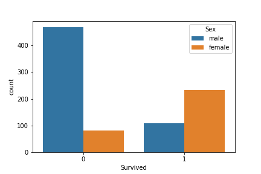
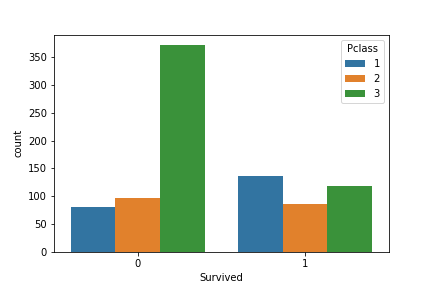
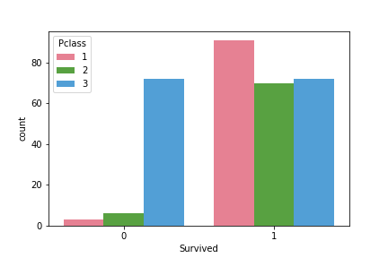
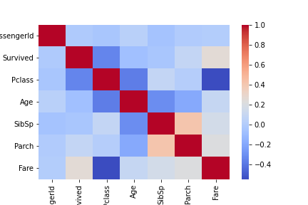

# Titanic-Survival
##### Dataset is taken from Kaggle and consists of the following features :
- Survival
- Ticket class
- Sex
- Age in years
- Number of siblings / spouses aboard on the Titanic
- Number of parents / children aboard on the Titanic
- Ticket number
- Passenger fare
- Cabin number
- Port of Embarkation

On doing some primary data analysis very interesting facts can be uncovered.
Following are some interesting plots of the data :

- ###### Count of Survived people with hue as sex.
 
From this plot we can infer that women (and children) were given first preference to board the lifeboats.

- ###### Count of Survived people with hue as Class.
 
One obvious thing infered here is that people from class 3 have a low chance of making it alive.

- ###### Count of Survived females with hue as Class.
 
This plot is the most interesting among all. Females from the first class had a very low mortality rate. Exactly speaking, only 3 of the class 1 females failed to make it safely.

- ###### Correlation of features
 
Correlation of features is shows that passenger class has a strong relation with fare, which makes perfect sense. Also there is a moderate type of relation between passenger class and age, this may be mostly because as age of a person increases he earns more than before and thus can afford a higher class. We can also see a relation between passenger class and the survival.

#### Some interesting facts:
- Survival rate of 1st class females : 96.81 %
- Survival rate of 3rd class females : 50.00 %
- Survival rate of 1st class males   : 36.89 %
- Survival rate of 3rd class males   : 13.54 %

Now you know why Jack was (almost) never destined to survive the disaster !  
